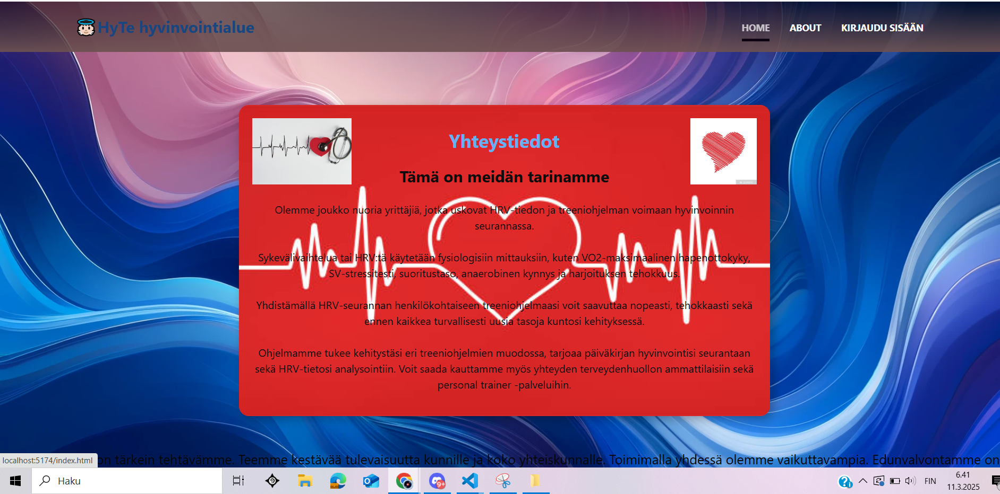
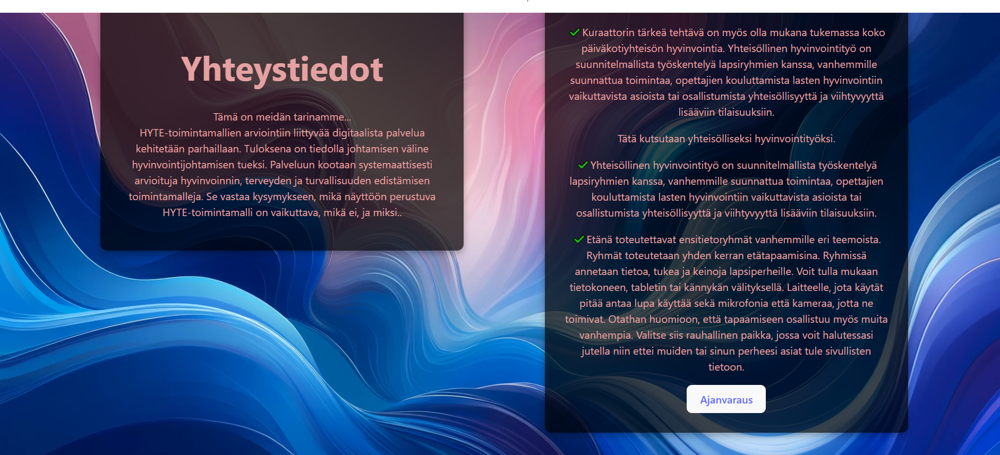
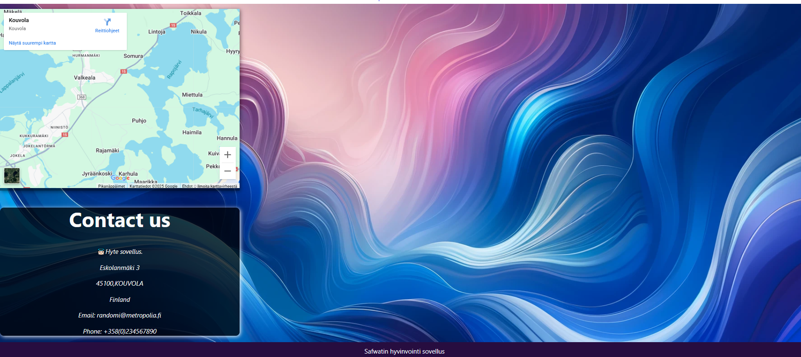
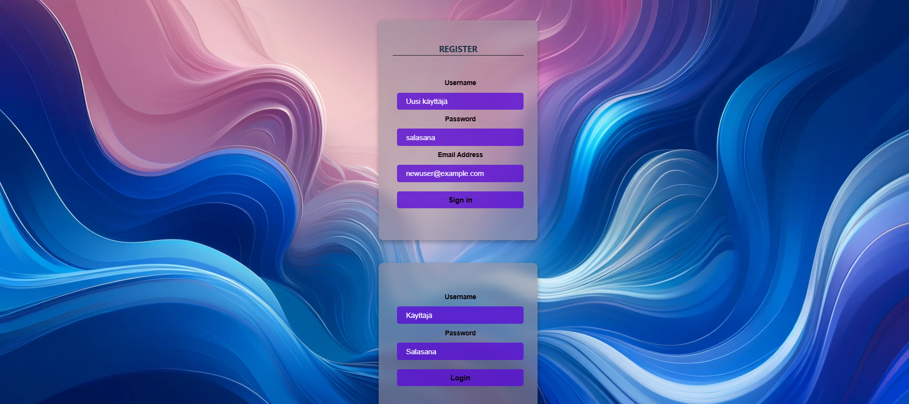
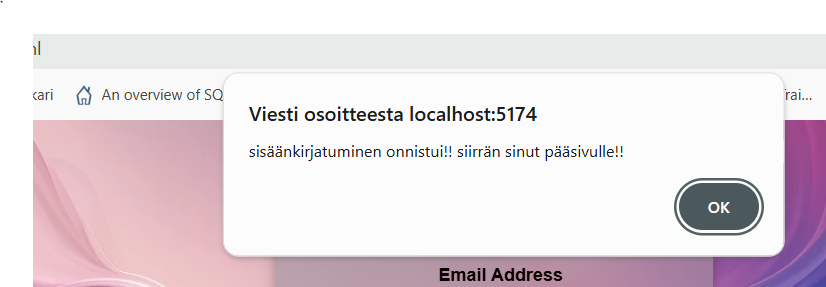
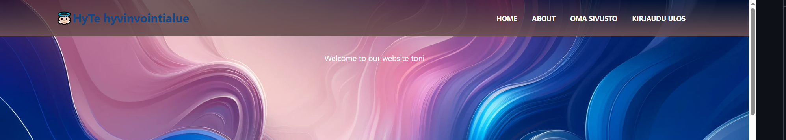
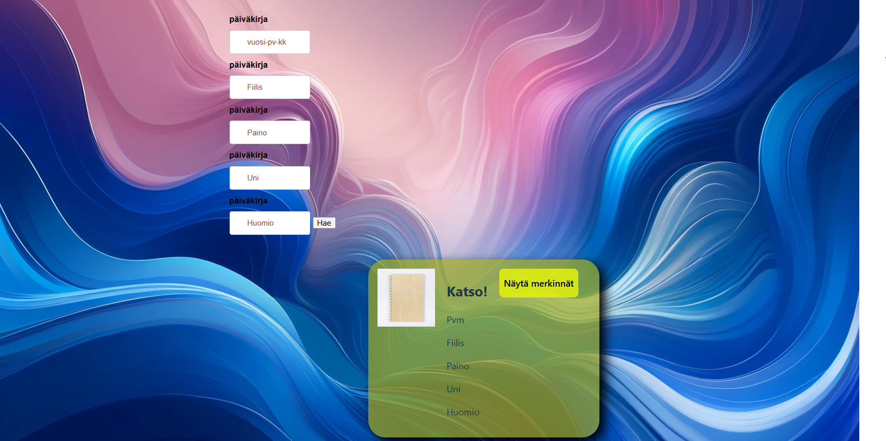
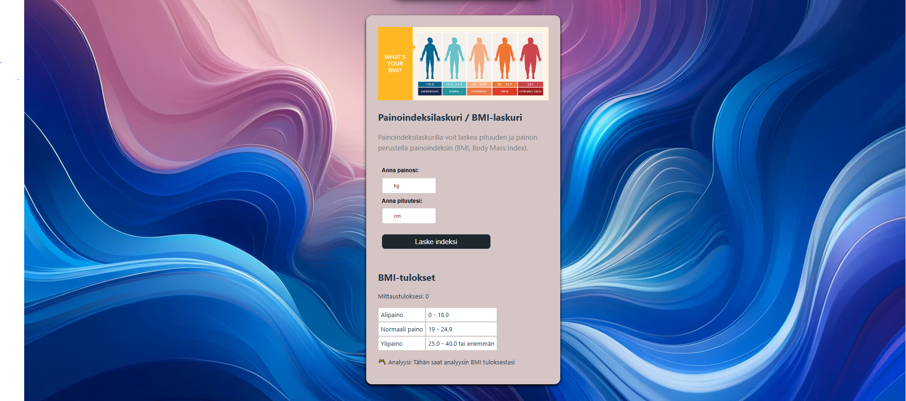

👼🏻HyTe – Hyvinvointialueen verkkosovellus
HyTe on hyvinvoinnin seurantasovellus, joka auttaa käyttäjiä seuraamaan terveyttään ja varaamaan ajan suoraan HUS:iin.

KÄYTTÖLIITTYMÄ

kuva 2 otettu 75% koska ei mahtunut

Linkki sovelluksseen 
FE front-end http://localhost:5174
BE back-end http:/loaclhost:3000/

API-DOKUMENTAATIO

API seuraavat pääpisteet on:
•	GET  /api/auth/users - hakee kaikki käyttäjä (vaatii autentikoinnin)
•	POST /api/users - Lisää uuden käyttäjän (vaatii käyttäjänimen, salasanan ja sähköpostin).
•	GET /api/users/:id - Hakee käyttäjän tiedot ID:n perusteella.
•	PUT /api/users/:id -  Päivittää käyttäjän tietoja.

Päiväkirjamerkinnät (Diary Entries) API 

•	POST /api/entries – Lisää uuden päiväkirjamerkinnän (vaatii autentikoinnin ja tietoja kuten päiväys, fiilis, paino, unen määrä jne.)
•	GET /api/entries – Hakee kaikki päiväkirjamerkinnät (vaatii autentikoinnin)
•	GET /api/entries/entries – Hakee päiväkirjamerkinnät käyttäjän ID:n perusteella.

Kirjautuminen (Auth) API (auth-router.js)

•	POST /api/auth/login – Käyttäjä voi kirjautua sisään.
•	GET /api/auth/me – Hakee kirjautuneen käyttäjän tiedot (vaatii autentikoinnin).

tietokannan
Mysql-tietokantaa käyttäjä nimeltä "Healt
Users
Käyttäjien tiedot:
•	user_id - Käyttäjän ID (primary key)
•	username - Käyttäjänimi (uniikki)
•	password - Salasana (bcrypt-suojattu)
•	email - Sähköposti (uniikki)

Sivut ja toiminnot:

•	Etusivu: Näet lyhyesti tietoja sovelluksesta.
•	Tietoa (About) -sivu: Tässä saat enemmän tietoa palvelusta. Näet myös kartan, josta löytyvät osoitteet ja mahdollisuus varata aika HUS:iin.
•	Kirjautuminen: Käyttäjä voi kirjautua sisään ja ulos. Sisäänkirjautumisen jälkeen käyttäjä pääsee omalle sivulleen.

Oma sivu:

•	Tervetulotoivotus omalla nimellä.
•	Päiväkirja, johon voi kirjoittaa omasta voinnistaan.
•	Sovellus antaa palautetta – joko positiivista tai negatiivista – ja ehdottaa seuraavia askeleita.
•	Mahdollisuus laskea BMI (painoindeksi).

Teknologiat ja kirjastot
Frontend
•	Vanilla JavaScript
•	HTML/CSS
•	Vite (build-työkalu)
Backend
•	Node.js
•	Express.js
•	MySQL (tietokanta)
•	bcrypt (salasanojen suojaus)
•	jsonwebtoken (JWT-autentikaatio)
•	cors (cross-origin resource sharing)

